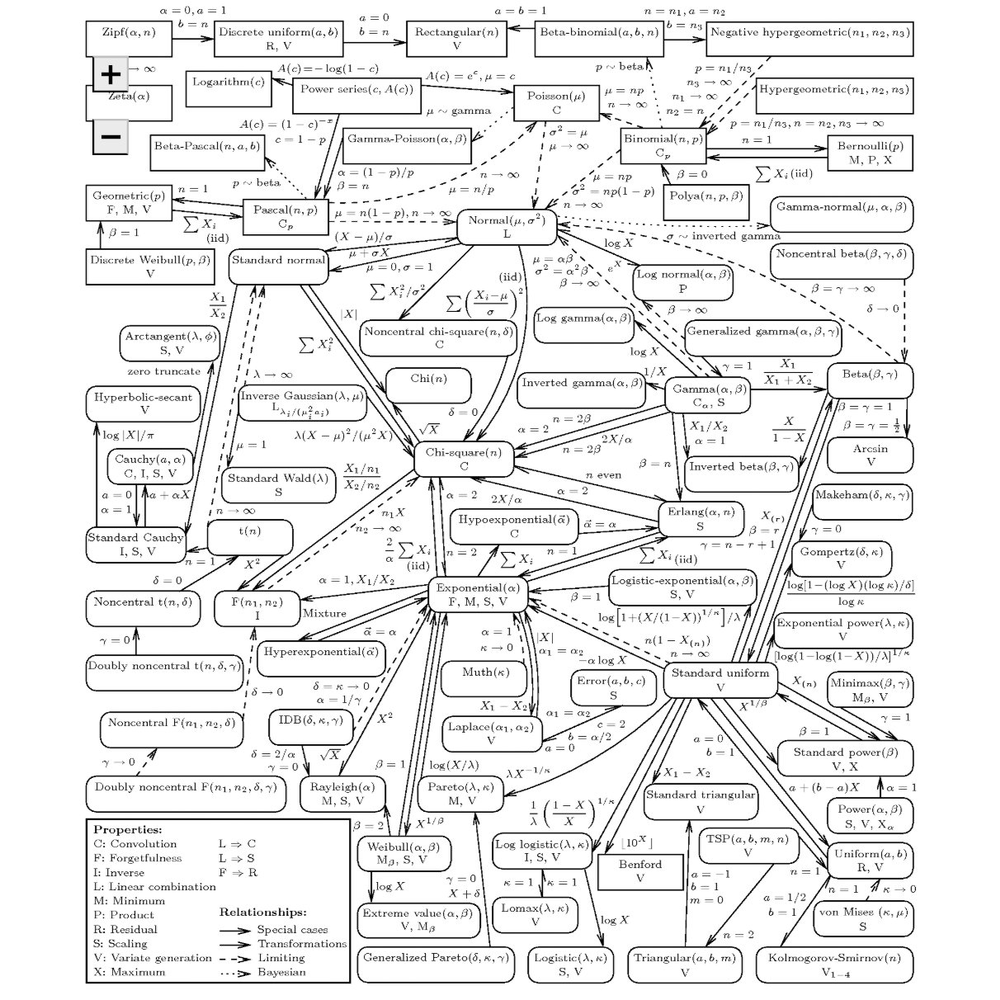

## Remarques générales:
- Les exemples et animations présents sur cette page sont publiés avec l'autorisation de Madame [Françoise Foucher](https://www.ec-nantes.fr/version-francaise/annuaire/francoise-foucher), responsable du cours de *Mathématiques pour l'ingénieur* à l'ECN;
- Sur cette page, il n'y aura pas de théorie, juste des jolies figures associées à des exercices de travaux pratiques.
- **Mes remerciements vont à [Barbara Pascal](https://bpascal-fr.github.io/)** pour m'avoir donné le code qui m'a permis de générer ces animations ;)

## Exemples proposés: 

1. [Optimisation par recherche linéaire](#optim_rl); 
2. [Optimisation linéaire sous contraintes](#optim_lin);
3. [Simulations de lois de probabilité et convergence des variables aléatoires](#simu_proba);
4. [Inférence statistiques](#stat_inf). 

---
# Optimisation par recherche linéaire:  <a name="optim_rl"></a> 
Faire une ref vers le Nocedal 

## Optimisation libre:  <a name="optim_rl_wocstr"></a> 
## Optimisation sous contraintes: <a name="optim_rl_wicstr"></a> 
---
# Optimisation linéaire sous contraintes: <a name="optim_lin"></a> 
Une série d'exemples issus de la [Recherche Opérationnelle](https://fr.wikipedia.org/wiki/Recherche_op%C3%A9rationnelle) et plus particulièrement de l'[optimisation combinatoire](https://fr.wikipedia.org/wiki/Optimisation_combinatoire).   
Un bon bouquin de *référence* est le [Wolsey](https://www.google.fr/books/edition/Integer_Programming/w-P7DwAAQBAJ?hl=fr&gbpv=0). 

## Problème de maximisation 
Le problème à résoudre est: 
$$
  (\mathcal{P}): \quad \max_{\boldsymbol{x}\in \mathbb{R}^{3}  }\quad  f(\boldsymbol{x}) \quad \textrm{st. } \quad \boldsymbol{x} \in \mathbf{K}
$$ 
où 
- $f(\boldsymbol{x})$ est la fonction objectif définie par: 
$$
  f(\boldsymbol{x}) := 155x_{1} +160x_{2}+150x_{3}
$$
- $\mathbf{K}$ est un ensemble de contraintes défini par: 
  - $16x_{1} + 13x_{2}+17x_{3} \leq 180$
  - $27x_{1} + 15x_{2}+ 11x_{3} \leq 160$
  - $\sum_{i=1}^{3} x_{i}=12$
  - $\boldsymbol{x} \geq 0 \Longleftrightarrow x_{i} \geq 0 \quad  \forall i \in \\{1,2,3\\}$

Les solveurs peuvent le faire à votre place, mais un bon moyen de résoudre ce problème revient à appliquer une approche polyédrale; des exemples de cours sont donnés [ici](https://www.lamsade.dauphine.fr/~poc/jpoc9/Chapitre-Polyedres.pdf) ou [là](https://www.andrew.cmu.edu/user/gc0v/webpub/IPsurveyAussois-11-08.pdf).   

Visuellement, la résolution du problème $(\mathcal{P})$ est proposé dans l'animation suivante: 



La solution optimale $\boldsymbol{x}^{*}$ au problème $(\mathcal{P})$ est donné par le point rouge.

## Problèmes de minimisation 
### Approche Polyèdrale
*TODO: mettre un lien vers l'algorithme du simplexe* 
### Approche par méthodes des flots dans un graphe. 
---
# Simulations de lois de probabilité et convergence des variables aléatoires: <a name="simu_proba"></a> 
Comme indiqué dans le titre, cette section s'intéresse à la simulation de lois de probabilité. Mais on part déjà avec un problème, l'ordinateur est [déterministe](https://fr.wikipedia.org/wiki/Algorithme_d%C3%A9terministe).   
Cependant, l'ordinateur génère efficacement des $0$ et des $1$.   

Pour le coup, on ne peut pas dire que l'on va simuler un *vrai* comportement aléatoire, on parlera plutôt de générateur [**pseudo-aléatoire**](https://fr.wikipedia.org/wiki/Pseudo-al%C3%A9atoire) à partir d'une loi **uniforme** sur $[0,1]$, notée $\mathcal{U}([0,1])$, en fixant une [graine (seed)](https://fr.wikipedia.org/wiki/Graine_al%C3%A9atoire) au préalable.  

La solution pour simuler un comportement pseudo-aléatoire avec un ordinateur est de produire une suite de nombres, suffisamment imprévisible, pour permettre d'imiter une suite $(u_{n})_{n\in \mathbb{N}^{*}}$ de variables aléatoires indépendantes de loi mère $\mathcal{U}([0,1])$. 

À partir de ça, il existe des formules de transformation qui permettent de générer des lois plus complexes à partir d'une loi $\mathcal{U}([0,1])$.




**Source:** [Univariate Distribution Relationships](https://www.tandfonline.com/doi/abs/10.1198/000313008X270448) - Leemis & McQueston (2008).

## Simulations de loi usuelles   
### Loi uniforme $ X \sim \mathcal{U}([0,1])$
Voici un premier de simulation de la loi uniforme, c'est joli non ? 



Deux parties sur ce graphique:
- En haut sont représentés les tirages en utilisant la fonction rand().
- En bas, nous utilisons l'histogramme pour regrouper les observations dans des classes identiques et où la surface de chaque est une approximation de la densité de probabilité (pour des lois continues).

Les calculs de l'espérance et de la variance sont réalisés à partir des moment d'ordre 1, 2 et de la formule de [König-Huygens](https://fr.wikipedia.org/wiki/Th%C3%A9or%C3%A8me_de_K%C3%B6nig-Huygens)

```
%Get the total number of draws for X simulation.
N = length(x);
% Use matlab to automatically sort observations into 10 classes.
[n_elem,cent] = hist(x);
% Determine the width of a class from the difference between class centers.
h = cent(2) - cent(1); 
ci = cent;
hauteurs = n_elem/(N*h);
f_ci = hauteurs*h ;
% Using definition of expected value: |E(X) = sum_i f_X(ci) * ci
% => We use a discrete approximation of the continuous pdf ... so it's a sum and not an integral.
E_hat = ci*(f_ci');
% Second order moment
ci2 = cent.^2;
% König-Huygens Formula
V_hat = ci2*(f_ci') - E_hat^2;
```

### Loi binomiale $ X \sim \mathcal{B}(n,p)$
La même chose mais cette fois-ci avec la binomiale :



### Loi normale $ X \sim \mathcal{N}(\mu,\sigma^{2})$
Enfin, un troisième exemple avec la loi incontournable en probabilité et statistique: 



Si on voit que les valeurs de l'espérance et de la variance empiriques sont un peu éloignées des valeurs théoriques, deux possiblités: 
- augmenter le nombre de tirage et attendre de voir ce que ça donne; 
- appliquer des méthodes de [réduction de variance](https://fr.wikipedia.org/wiki/R%C3%A9duction_de_la_variance), mais c'est pas au programme.

## Le Théorème Central Limite  
*Bon en gros, tout est normal*


## Loi forte des grands nombres 

C'est un résultat de convergence assez puissant qui s'énonce comme suit:   
> Si $(X_{n})_{n\in\mathbb{N}}$ est une suite de variables aléatoires iid telle que $X_i \in \mathcal{L}^{1}(\Omega)$ avec $\mathbb{E}(X_i) = m$ $\forall i \in \\{1,...,n\\}$, alors 
> $$\bar{X}_n = \frac{1}{n} \sum_1^n X_i  \overset{ps.}{\to} \mathbb{E}(X_i) = m \text{ quand } n \to +\infty.$$
> Dans le cas où $X_i \in \mathcal{L}^{2}(\Omega)$ avec $\mathbb{E}(X_i) = m$, on obtient un résultat similaire en étudiant la somme des $X_i - m$ et on prouve sa convergence vers $0$. 

Donc pour faire simple, cette loi nous dit qu'à partir d'une suite de variables aléatoires, on va converger [presque sûrement](https://www.bibmath.net/dico/index.php?action=affiche&quoi=./p/presquesur.html) vers une quantité déterministe $m\in \mathbb{R}$.  

On peut illustrer graphiquement ce résultat pour: 
- la loi uniforme $\mathcal{U}([0,1])$:

- la loi de Poisson $\mathcal{P}(\lambda)$ avec $\lambda \in \mathbb{R}_+^*$:


## Application d'une méthode Monte Carlo pour approcher $\pi$

---
# Inférence statistiques: <a name="stat_inf"></a> 
Il s'agit dans cette partie de déterminer un estimateur du paramètre d'une loi de probabilité donnée.  

On prend par exemple le cas d'une élection entre deux candidats $C_{1}$ et $C_{0}$ et on se fixe une variable aléatoire $X_{i} \in \left\\{0,1\right\\}$ qui représente la préférence d'un citoyen telle que $X_{i}=1$ si il préfère le candidat $C_{1}$ (vous devinerez ce que signifie $X_{i}=0$).   
De manière générale, les probabilités et statistiques sont précises quand on prend un grand nombre d'observation, il va donc falloir sonder un nombre $N$ d'électeurs. 

A partir des préférences recueillies, on va chercher à estimer la proportion $p$ de suffrages qui préfèrent le candidat $C_{1}$ et en déduire un intervalle de confiance $I_{n}$  pour un risque $\alpha \in \mathbb{R}_+$ (parce qu'on peut se tromper).  

La modélisation de ce problème peut se faire en remarquant que les intentions de vote collectées peuvent être exprimés exprimés comme un $N$-échantillon de loi mère $X_i\sim \mathcal{B}(p)$ avec $X_{i}(\Omega) \in \\{0,1\\}$ $\forall i \in \\{1,...,N\\}$ .  
On sait que la proportion $\bar{p}$ admet un estimateur des moments d'ordre 1 noté $\bar{X}_{n}$ qui possède des chouettes propriétés $\forall n \in \\{1,...,N\\}$:
- il est sans biais *ie.*  $\mathbb{E}(\bar{X}_{n}) = p$;
- il converge presque sûrement vers $p$;
- puisque $X_{i} \in \mathcal{L}^{2}(\Omega)$, il admet un moment d'ordre 2 et une variance $V(\bar{X}_{n})$ qui converge vers 0 quand $n\rightarrow+\infty$.

L'expression de cet estimateur est donnée par:
$$
\bar{X}_{n}:=\frac{1}{n} \sum_i^n X_i \quad \forall n \in \\{1,...,N\\}
$$

Comme on chercher un estimateur d'une quantité inconnue, on construit un intervalle de confiance $I_{n}$ au risque $\alpha\in \mathbb{R}_+$ de se tromper. 
En appliquant le TCL et la propriété de convergence ps. de $\bar{X}_n$, on peut calculer l'erreur d'estimation:   

$$
\epsilon_{n}:= z_{\frac{\alpha}{2}} \sqrt{ \frac{\bar{X}_{n} (1- \bar{X}_n )}{n}} \quad \forall n \in \\{1,...,N\\}
$$
où $z$ est le quantile d'ordre $\alpha$ pour la loi $\mathcal{N}(0,1)$. 

L'intervalle de confiance pour l'estimateur $\bar{X}_{n}$ s'exprime tel que: 

$$
  I_{n} := [ \bar{X}\_{n} -\epsilon_{n},\bar{X}\_{n}+\epsilon_{n}] \quad \forall n \in \\{1,...,N\\}
$$

Maintenant qu'on a tout ça, on peut construire l'estimateur et l'intervalle de confiance associé dans le cas où la population préfère le candidat $C_{1}$ à 51% et ceci:
- au risque $\alpha = 5$%

- au risque $\alpha = 1$%


Je vous laisse étudier les comportements obtenus.


**Note :** Il s'agit d'un exemple pour un estimateur paramétrique par la méthode des moments, mais il existe d'autres méthodes pour calculer des estimateurs *eg.* le maximum de vraisemblance.

---

## Extra:
Deux fiches synthèses sur les principales commandes Matlab à garder en tête:
- [MATLAB Fundamentals - Res Jöhr](PDF/MATLAB_Fundamentals_ETH_Zürich.pdf)
- [Matlab Cheat Sheet - Thor Nielsen](PDF/Nielsen2015_MatlabCheatSheet.pdf)

<!-- 
> Écrit à l'origine pour m'éviter de répéter constamment les mêmes conseils à mes étudiants, ce manuel a connu une diffusion assez large.   
> **Umberto Eco** - Comment écrire sa thèse (1977)

1. Le [Contexte](#contexte)
2. Le [Mantra](#mantra) puis le modèle [entrée](#entree)/[plat](#plat)/[dessert](#dessert)/[digestif](#digestif)
3. La [Moralité](#moralite)

---
# Contexte <a name="contexte"></a>
Initialement écrit pour les TP de CSOPT ([Datasim](https://www.ec-nantes.fr/formation/les-options-de-2e-et-3e-annee/option-donnees-analyse-traitement-et-applications-en-signal-et-image)), on se rend compte que ça sert à tout le monde. 

Ce n’est pas pour être embêtant mais pour vous préparer à l’écriture de vos rapports de stage, vos projets biblios, votre thèse … 
>  Que vous continuiez en thèse ou dans le monde de l’entreprise,  il est important de poser le contexte dans les écrits que vous produirez pour vos supérieurs, clients, directeurs de thèses …   
> dixit **Gwen.S** (2023)

---

# Mantra  <a name="mantra"></a>
Le « Mantra » principal est
<center> <i> On doit pouvoir lire un rapport sans avoir à se référer au sujet. </i></center>
</br>

**Pour faire simple:** Pour chaque question, faire

## Entrée, l’intro :  <a name="entree"></a>
Une phrase de contexte où vous dites ce que vous allez faire, prouver, montrer, … On évite **au maximum** de faire appel au numéro des questions dans le sujet afin d'être cohérent avec le mantra *ie.* on évite:
```
1.a: la réponse est ...
...
2.f: on trouve x=9
...
42.z: ça converge.  
```
## Plat, le développement :  <a name="plat"></a>

- **Si question mathématique :** de la rigueur ie. hypothèses (ou l’endroit d’où vous partez) , résultats de cours utilisés, étapes de calculs (pas besoin de tout mettre si les opérations sont triviales), … 

Pensez au [LaTeX](https://en.wikipedia.org/wiki/LaTeX) pour la rédaction de vos documents avec un éditeur type [Overleaf](https://www.overleaf.com/) si vous rendez un CR à plusieurs.
- **Si tableau synthèse :** Tout est dans le titre de cette section, c’est censé être une synthèse … ne pas hésiter à mettre en valeur (avec du gras ou de la couleur) les résultats que vous jugez utiles, pertinents. Par exemple, le code LaTeX: 
```
\begin{table}[H]
\centering
\begin{tabular}{c|c|c|c|}
\cline{2-4}
\textbf{} & \textbf{Méthode 1} & \textbf{Methode 2} & \textbf{Méthode 3} \\ \hline
\multicolumn{1}{|c|}{\textbf{$\hat{x}$}} & $(.,.)^{\intercal}$ & $(.,.)^{\intercal}$ & $(.,.)^{\intercal}$ \\ \hline
\multicolumn{1}{|c|}{\textbf{$\hat{z} := f(\hat{x})$}} & 0 & \textcolor{blue}{$\infty$} & $\ln (3)$ \\ \hline
\multicolumn{1}{|c|}{Nb d'itérations} & $666$ & $24$ & $\begingroup \color{red}{4} \endgroup 2$ \\ \hline
\multicolumn{1}{|c|}{Nature de $\hat{x}$} & \textcolor{magenta}{$\min$ local} & $\max$ local & point col \\ \hline
\end{tabular}
\caption{Données obtenues avec $x_{0} = (\dots)^{\intercal} \in \mathbb{R}^{n}$ avec $\rho = \dots$ et un nombre d'itération maximal $\text{iter}_{\max} = \dots$ }
\label{tab:dummy_tab}
\end{table}
```
permet d'obtenir le tableau suivant: 


Et on discute les résultats obtenus ;).

*Tip pour se simplifier la vie avec les tableaux latex:* 
Créez vos tableaux dans un tableur et mettez en forme avec [Table generator](https://www.tablesgenerator.com/)

- **Si on vous demande de tracer un truc :**
#### Protocole de la jolie figure (en Matlab, mais généralisable à d'autres langages ):
```
figure ; hold on ; 
[box on ; grid on] ; // […] signifie optionnel.  
// Vos données à tracer (les couleurs sont importantes, 
// on doit voir directement ce que vous souhaitez montrer, 
// donc on va dans la doc de la fonction plot())
xlabel(‘’) ; ylabel(‘’) ; title(‘’) ; 
// et sgtitle(‘’) si vous avez décidé de faire des subplot() cf la doc.
legend(‘’) ; // idem, regardez la doc.
```
#### Tips pour des figures propres :
- allez voir dans les docs le ‘Interpreter’,’latex’
- gagnez du temps dans la création de la légende avec matlab :
```
p1 = plot(…,‘Displayname’, "bla") ;
p2 = plot(…,‘Displayname’, "blo") ;
// [...]
legend([p1,p2],…) ;  
```
#### Un exemple de jolie figure - Cours de B.Pascal Datasim/CSOPT
Pour les curieux, le cours de B.Pascal [Nonsmooth convex optimization](https://bpascal-fr.github.io/teaching/).


Le code Matlab correspondant (possible de faire la même chose avec Python ou Julia): 
```
x = linspace(-10,10,1000);
figure; 
  sgtitle("$\ell_{1}$ norm",'Interpreter','latex','FontSize',20)
  subplot(1,2,1)
    hold on; box on; grid minor;
    plot(x,abs(x),'b','LineWidth',2);
    yline(0,'k--'); xline(0,'k--');
    ylim([-1,max(x)]);
    xlabel('$x$','Interpreter','latex','FontSize',12); 
    ylabel('$y$','Interpreter','latex','Rotation',0,'FontSize',12);    
    title("$f:x \mapsto |x|$",'Interpreter','latex','FontSize',16);
  subplot(1,2,2)
    hold on; box on; grid minor; 
    gamma = 1;  p = prox_l1(x,gamma);
    p1 = plot(x,p,'-','LineWidth',2,'Displayname',"$\gamma="+num2str(gamma)+"$",'Color','#7E2F8E');
    gamma = 2;  p = prox_l1(x,gamma);
    p2 = plot(x,p,'--','LineWidth',2,'Displayname',"$\gamma="+num2str(gamma)+"$",'Color','#EDB120');
    gamma = 3.5;  p = prox_l1(x,gamma);
    p3 = plot(x,p,':','LineWidth',2,'Displayname',"$\gamma="+num2str(gamma)+"$",'Color','#A2142F');
    yline(0,'k--'); xline(0,'k--');
    xlabel('$x$','Interpreter','latex','FontSize',12);
    ylabel('$y$','Interpreter','latex','Rotation',0,'FontSize',12);
    title("prox$_{\gamma \|\cdot\|_{1}}(x)$",'Interpreter','latex','FontSize',16)
    legend([p1,p2,p3],'Location','best','FontSize',16,'Interpreter','latex'); legend boxoff
```

#### Pour aller plus loin: 
On peut faire de chouettes figures et animations avec Matlab: 
- un exemple avec le code [Ariane](https://gitlab.com/mlatif/tep3g-ariane) pour le calcul de la matrice système en imagerie Compton:
  - Ariane dans le plan:

  - Ariane dans l'espace:


- un exemple d'application d'une méthode Monte Carlo pour l'approximation de $\pi$ par *Pluie aléatoire*: 

*cf.* Maths EI1/TP5, animation présentée aux étudiants.

## Dessert, la conclusion :  <a name="dessert"></a>
bon bah là, discutez la figure obtenue ou donnez le résultat mathématique obtenu, bref discutez et soyez critiques vis-à-vis de ce que vous présentez.

## Le digestif, les remarques générales:  <a name="digestif"></a>

Si on file la métaphore du restaurant : 
-	**Le menu:** c’est l’introduction générale du TP, ce que l’on va étudier dans ce rapport de TP. Même si cela suppose faire des paraphrases du sujet, c’est toujours bien de faire comprendre au lecteur/correcteur/rapporteur l’endroit d’où il part **et** à quelle sauce il va être mangé. 
-	**L’addition:** c’est la conclusion générale du TP ; il faut donner les grandes lignes de l’étude qui a été réalisée durant le rapport, les idées et les conclusions. Pas besoin de trop de blabla si vous avez été efficaces dans les desserts de chaque question.  

---

# Moralité:  <a name="moralite"></a>
Moralité, maintenant que vous avez tout ça, nous serons intraitables sur les rapports que nous allons corriger et si vous avez des questions, n'hésitez pas à envoyer un [mail](mailto:mehdi.latif@ls2n.fr?subject=[mlatif.fr]%20Question%rédaction%20TP...) -->


