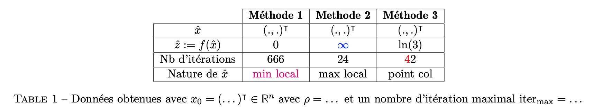
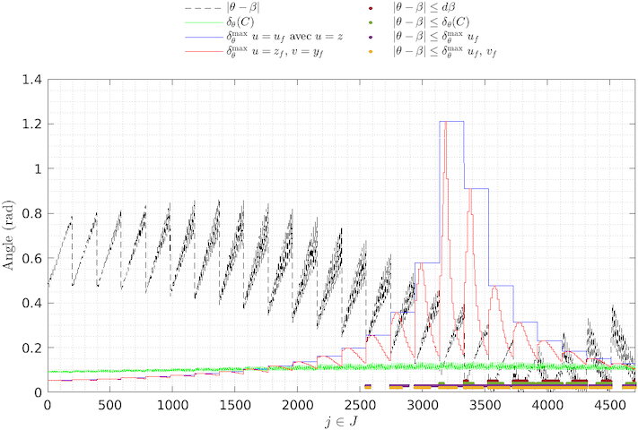
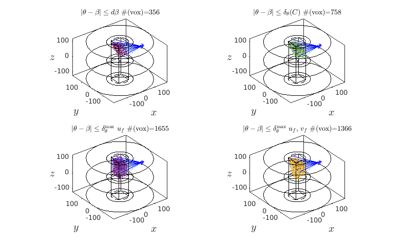

> Écrit à l'origine pour m'éviter de répéter constamment les mêmes conseils à mes étudiants, ce manuel a connu une diffusion assez large.   
> **Umberto Eco** - Comment écrire sa thèse (1977)

1. Le [Contexte](#contexte)
2. Le [Mantra](#mantra) puis le modèle [entrée](#entree)/[plat](#plat)/[dessert](#dessert)/[digestif](#digestif)
3. La [Moralité](#moralite)

---
# Contexte <a name="contexte"></a>
Initialement écrit pour les TP de CSOPT ([Datasim](https://www.ec-nantes.fr/formation/les-options-de-2e-et-3e-annee/option-donnees-analyse-traitement-et-applications-en-signal-et-image)), on se rend compte que ça sert à tout le monde. 

Ce n’est pas pour être embêtant mais pour vous préparer à l’écriture de vos rapports de stage, vos projets biblios, votre thèse … 
>  Que vous continuiez en thèse ou dans le monde de l’entreprise,  il est important de poser le contexte dans les écrits que vous produirez pour vos supérieurs, clients, directeurs de thèses …   
> dixit **Gwen.S** (2023)

---

# Mantra  <a name="mantra"></a>
Le « Mantra » principal est
<center> <i> On doit pouvoir lire un rapport sans avoir à se référer au sujet. </i></center>
</br>
Pour faire simple : **Pour chaque question, faire:**

## Entrée, l’intro :  <a name="entree"></a>
Une phrase de contexte où vous dites ce que vous allez faire, prouver, montrer, … On évite **au maximum** de faire appel au numéro des questions dans le sujet afin d'être cohérent avec le mantra *ie.* on évite:
```
1.a: la réponse est ...
...
2.f: on trouve x=9
...
42.z: ça converge.  
```
## Plat, le développement :  <a name="plat"></a>

- **Si question mathématique :** de la rigueur ie. hypothèses (ou l’endroit d’où vous partez) , résultats de cours utilisés, étapes de calculs (pas besoin de tout mettre si les opérations sont triviales), … 

Pensez au [LaTeX](https://en.wikipedia.org/wiki/LaTeX) pour la rédaction de vos documents avec un éditeur type [Overleaf](https://www.overleaf.com/) si vous rendez un CR à plusieurs.
- **Si tableau synthèse :** Tout est dans le titre de cette section, c’est censé être une synthèse … ne pas hésiter à mettre en valeur (avec du gras ou de la couleur) les résultats que vous jugez utiles, pertinents. Par exemple, le code LaTeX: 
```
\begin{table}[H]
\centering
\begin{tabular}{c|c|c|c|}
\cline{2-4}
\textbf{} & \textbf{Méthode 1} & \textbf{Methode 2} & \textbf{Méthode 3} \\ \hline
\multicolumn{1}{|c|}{\textbf{$\hat{x}$}} & $(.,.)^{\intercal}$ & $(.,.)^{\intercal}$ & $(.,.)^{\intercal}$ \\ \hline
\multicolumn{1}{|c|}{\textbf{$\hat{z} := f(\hat{x})$}} & 0 & \textcolor{blue}{$\infty$} & $\ln (3)$ \\ \hline
\multicolumn{1}{|c|}{Nb d'itérations} & $666$ & $24$ & $\begingroup \color{red}{4} \endgroup 2$ \\ \hline
\multicolumn{1}{|c|}{Nature de $\hat{x}$} & \textcolor{magenta}{$\min$ local} & $\max$ local & point col \\ \hline
\end{tabular}
\caption{Données obtenues avec $x_{0} = (\dots)^{\intercal} \in \mathbb{R}^{n}$ avec $\rho = \dots$ et un nombre d'itération maximal $\text{iter}_{\max} = \dots$ }
\label{tab:dummy_tab}
\end{table}
```
permet d'obtenir le tableau suivant: 



Et on discute les résultats obtenus ;).

*Tip pour se simplifier la vie avec les tableaux latex:* 
Créez vos tableaux dans un tableur et mettez en forme avec [Table generator](https://www.tablesgenerator.com/)

- **Si on vous demande de tracer un truc :**
#### Protocole de la jolie figure (en Matlab, mais généralisable à d'autres langages ):
```
figure ; hold on ; 
[box on ; grid on] ; // […] signifie optionnel.  
// Vos données à tracer (les couleurs sont importantes, 
// on doit voir directement ce que vous souhaitez montrer, 
// donc on va dans la doc de la fonction plot())
xlabel(‘’) ; ylabel(‘’) ; title(‘’) ; 
// et sgtitle(‘’) si vous avez décidé de faire des subplot() cf la doc.
legend(‘’) ; // idem, regardez la doc.
```
#### Tips pour des figures propres :
- allez voir dans les docs le ‘Interpreter’,’latex’
- gagnez du temps dans la création de la légende avec matlab :
```
p1 = plot(…,‘Displayname’, "bla") ;
p2 = plot(…,‘Displayname’, "blo") ;
// [...]
legend([p1,p2],…) ;  
```
#### Un exemple de jolie figure - Cours de B.Pascal Datasim/CSOPT
Pour les curieux, le cours de B.Pascal [Nonsmooth convex optimization](https://bpascal-fr.github.io/teaching/).


Le code Matlab correspondant (possible de faire la même chose avec Python ou Julia): 
```
x = linspace(-10,10,1000);
figure; 
  sgtitle("$\ell_{1}$ norm",'Interpreter','latex','FontSize',20)
  subplot(1,2,1)
    hold on; box on; grid minor;
    plot(x,abs(x),'b','LineWidth',2);
    yline(0,'k--'); xline(0,'k--');
    ylim([-1,max(x)]);
    xlabel('$x$','Interpreter','latex','FontSize',12); 
    ylabel('$y$','Interpreter','latex','Rotation',0,'FontSize',12);    
    title("$f:x \mapsto |x|$",'Interpreter','latex','FontSize',16);
  subplot(1,2,2)
    hold on; box on; grid minor; 
    gamma = 1;  p = prox_l1(x,gamma);
    p1 = plot(x,p,'-','LineWidth',2,'Displayname',"$\gamma="+num2str(gamma)+"$",'Color','#7E2F8E');
    gamma = 2;  p = prox_l1(x,gamma);
    p2 = plot(x,p,'--','LineWidth',2,'Displayname',"$\gamma="+num2str(gamma)+"$",'Color','#EDB120');
    gamma = 3.5;  p = prox_l1(x,gamma);
    p3 = plot(x,p,':','LineWidth',2,'Displayname',"$\gamma="+num2str(gamma)+"$",'Color','#A2142F');
    yline(0,'k--'); xline(0,'k--');
    xlabel('$x$','Interpreter','latex','FontSize',12);
    ylabel('$y$','Interpreter','latex','Rotation',0,'FontSize',12);
    title("prox$_{\gamma \|\cdot\|_{1}}(x)$",'Interpreter','latex','FontSize',16)
    legend([p1,p2,p3],'Location','best','FontSize',16,'Interpreter','latex'); legend boxoff
```

#### Pour aller plus loin: 
On peut faire de chouettes figures et animations avec Matlab: 
- un exemple avec le code [Ariane](https://gitlab.com/mlatif/tep3g-ariane) pour le calcul de la matrice système en imagerie Compton:
Ariane dans le plan             |  Ariane dans l'espace
:-------------------------:|:-------------------------:
  |  

- un exemple d'application d'une méthode Monte Carlo pour l'approximation de $\pi$ par *Pluie aléatoire* (*cf.* Maths EI1/TP5):


## Dessert, la conclusion :  <a name="dessert"></a>
bon bah là, discutez la figure obtenue ou donnez le résultat mathématique obtenu, bref discutez et soyez critiques vis-à-vis de ce que vous présentez.

## Le digestif, les remarques générales:  <a name="digestif"></a>

Si on file la métaphore du restaurant : 
-	**Le menu:** c’est l’introduction générale du TP, ce que l’on va étudier dans ce rapport de TP. Même si cela suppose faire des paraphrases du sujet, c’est toujours bien de faire comprendre au lecteur/correcteur/rapporteur l’endroit d’où il part **et** à quelle sauce il va être mangé. 
-	**L’addition:** c’est la conclusion générale du TP ; il faut donner les grandes lignes de l’étude qui a été réalisée durant le rapport, les idées et les conclusions. Pas besoin de trop de blabla si vous avez été efficaces dans les desserts de chaque question.  

---

# Moralité:  <a name="moralite"></a>
Moralité, maintenant que vous avez tout ça, nous serons intraitables sur les rapports que nous allons corriger et si vous avez des questions, n'hésitez pas à envoyer un [mail](mailto:mehdi.latif@ls2n.fr?subject=[mlatif.fr]%20Question%20mantra%20TP...)


