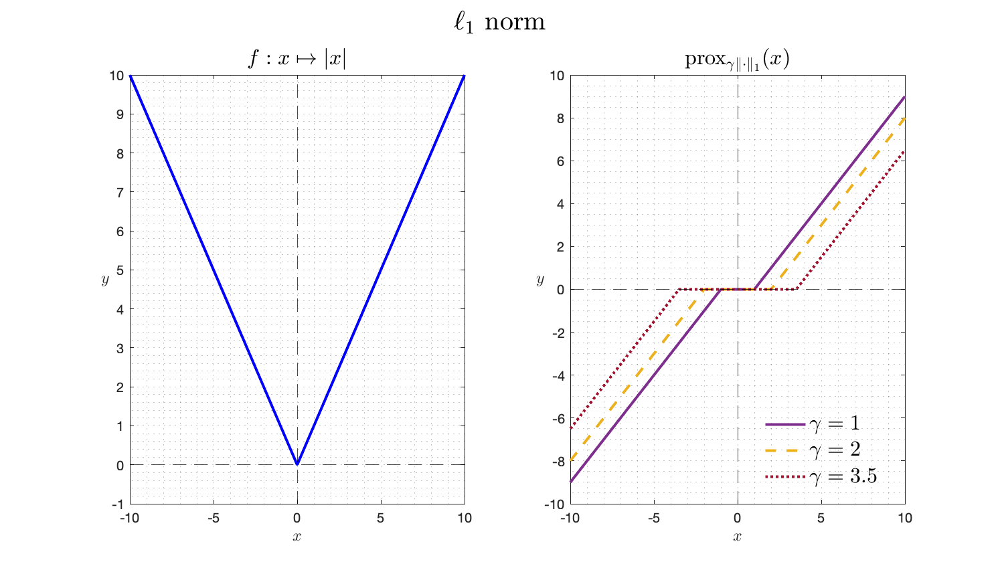

Un petit message pour vous rappeler les attentes que nous avons mentionné lors du TP ; pour mémoire, ce n’est pas pour être embêtant mais pour vous préparer à l’écriture de vos rapports de stage, vos projets biblios, … que vous continuiez en thèse ou dans le monde de l’entreprise (dixit Gwen : « ... » sur l’importance du contexte dans les écrits que vous produirez pour vos supérieurs, clients, mamans et papas de thèses …).

## « Mantra » principal : On doit pouvoir lire un rapport sans avoir à se référer au sujet.
Pour faire simple : pour chaque question, faire :

### Entrée, l’intro : 
Une phrase de contexte où vous dites ce que vous allez faire, prouver, montrer, …
### Plat, le développement :
- **Si question mathématique :** de la rigueur ie. hypothèses (ou l’endroit d’où vous partez) , résultats de cours utilisés, étapes de calculs (pas besoin de tout mettre si les opérations sont triviales), …
- **Si on vous demande de tracer un truc :**

*Protocole de la jolie figure (en Matlab, mais généralisable):*
```
figure ; hold on ; 
[box on ; grid on] ; // […] signifie optionnel.  
// Vos données à tracer (les couleurs sont importantes, 
// on doit voir directement ce que vous souhaitez montrer, 
// donc on va dans la doc de la fonction plot())
xlabel(‘’) ; ylabel(‘’) ; title(‘’) ; 
// et sgtitle(‘’) si vous avez décidé de faire des subplot() cf la doc.
legend(‘’) ; // idem, regardez la doc.
```
*Tips pour des figures propres :*
- allez voir dans les docs le ‘Interpreter’,’latex’
- gagnez du temps dans la création de la légende avec matlab :
```
p1 = plot(…,‘Displayname’, "bla") ;
p2 = plot(…,‘Displayname’, "blo") ;
// [...]
legend([p1,p2],…) ;  
```


Le code Matlab correspondant: 

```
x = linspace(-10,10,1000);
figure; 
  sgtitle("$\ell_{1}$ norm",'Interpreter','latex','FontSize',20)
  subplot(1,2,1)
    hold on; box on; grid minor;
    plot(x,abs(x),'b','LineWidth',2);
    yline(0,'k--'); xline(0,'k--');
    ylim([-1,max(x)]);
    xlabel('$x$','Interpreter','latex','FontSize',12); 
    ylabel('$y$','Interpreter','latex','Rotation',0,'FontSize',12);    
    title("$f:x \mapsto |x|$",'Interpreter','latex','FontSize',16);
  subplot(1,2,2)
    hold on; box on; grid minor; 
    gamma = 1;  p = prox_l1(x,gamma);
    p1 = plot(x,p,'-','LineWidth',2,'Displayname',"$\gamma="+num2str(gamma)+"$",'Color','#7E2F8E');
    gamma = 2;  p = prox_l1(x,gamma);
    p2 = plot(x,p,'--','LineWidth',2,'Displayname',"$\gamma="+num2str(gamma)+"$",'Color','#EDB120');
    gamma = 3.5;  p = prox_l1(x,gamma);
    p3 = plot(x,p,':','LineWidth',2,'Displayname',"$\gamma="+num2str(gamma)+"$",'Color','#A2142F');
    yline(0,'k--'); xline(0,'k--');
    xlabel('$x$','Interpreter','latex','FontSize',12);
    ylabel('$y$','Interpreter','latex','Rotation',0,'FontSize',12);
    title("prox$_{\gamma \|\cdot\|_{1}}(x)$",'Interpreter','latex','FontSize',16)
    legend([p1,p2,p3],'Location','best','FontSize',16,'Interpreter','latex'); legend boxoff
```


### Dessert, la conclusion : 
bon bah là, discutez la figure obtenue ou donnez le résultat mathématique obtenu, bref discutez et soyez critiques vis-à-vis de ce que vous présentez.

Moralité, maintenant que vous avez tout ça, nous serons intraitables sur les rapports que nous allons corriger.